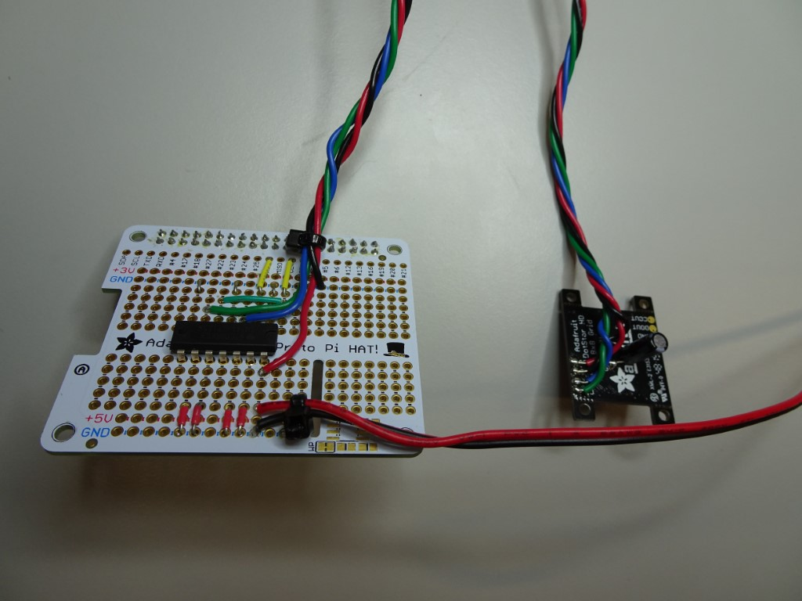
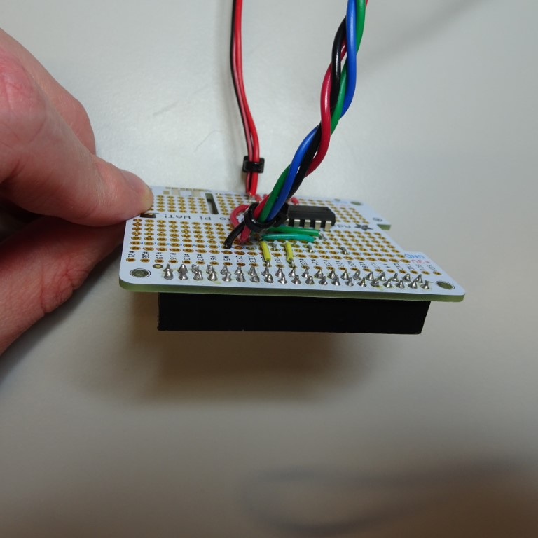
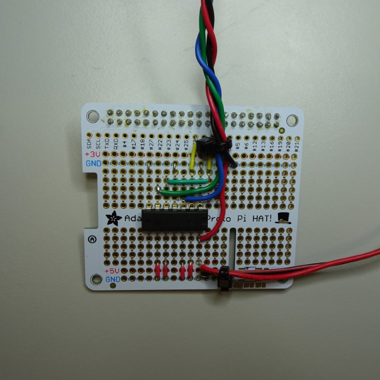
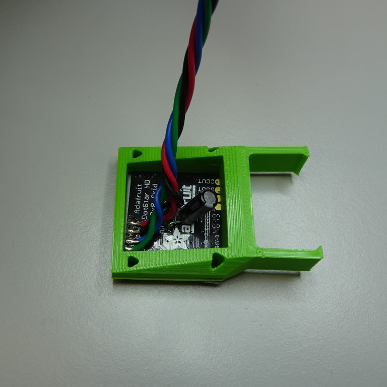
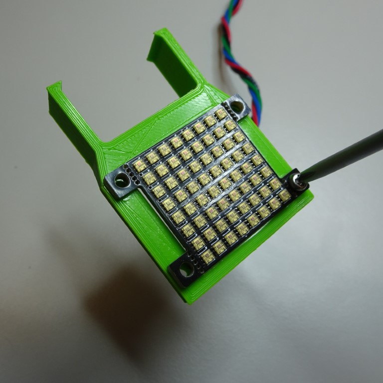

# LED grid illumination

Using a LED grid for illumination opens up new imaging modalities, such as darkfield, Rheinberg and phase imaging.  These instructions show you how to use a LED grid with the OpenFlexure Delta Stage. This module is still under test, and requires some electronics experience, so please proceed with caution.

{{BOM}}

[Adafruit 3444 LED grid]: models/led_grid.md "{cat:part}"
[perma-proto board]: models/perma-proto_board.md "{cat:part}"
[LED wire]: models/led_wire.md "{cat:part}"
[74AHCT125]: models/74AHCT125.md "{cat:part}"
[USB cable]: models/USB_cable.md "{cat:part}"
[soldering iron]: "{cat:tool}"
[solder]: "{cat:part}"
[M2.5x8mm]: "{cat:part}"
[USB plug]: "{cat:part}"
[LED array holder]: models/LED_array_holder.stl "{cat:3DPrinted}"

# Hardware

## Solder the parts

Solder the [Adafruit 3444 LED grid]{qty:1} to the [perma-proto board]{qty:1} with the [74AHCT125]{qty:1} chip.  You will need to power the LED grid, we recommend using a [USB cable]{qty:1} with a high power [USB plug]{qty:1} for convenience. 

Please make reference to the [fritzing diagram](fritzing/LED_grid.fzz).  Of course, you can always try it out with a breadboard before soldering to the perma-proto board.

## Attach the LED grid to the holder

Pass the [Adafruit 3444 LED grid] through the [LED array holder]{qty:1}. Secure it in place with four [M2.5x8mm screws].

## Put perma-proto board on Raspberry Pi in base

# Software

## Enable SPI

## Download the extensions

