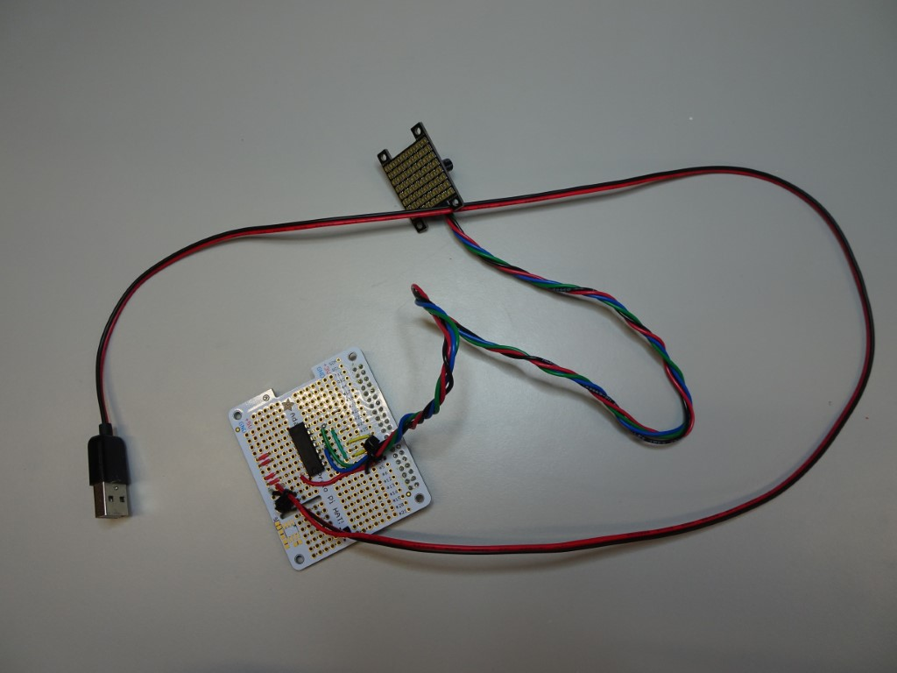
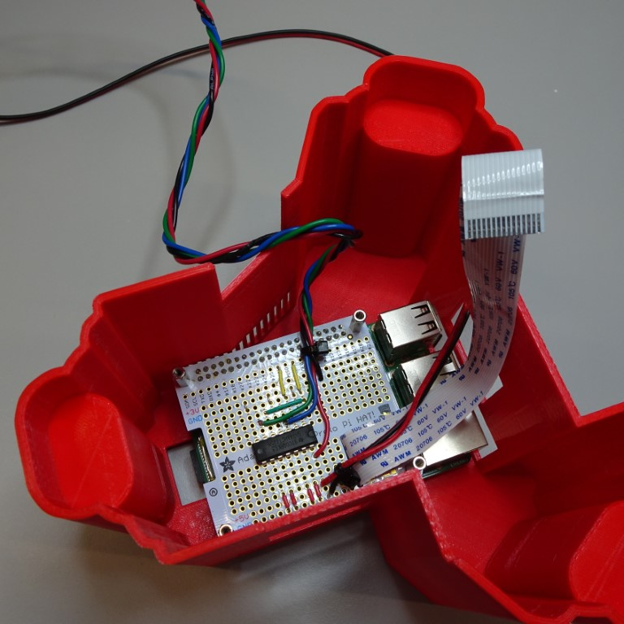
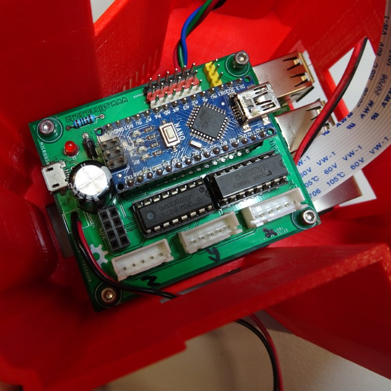
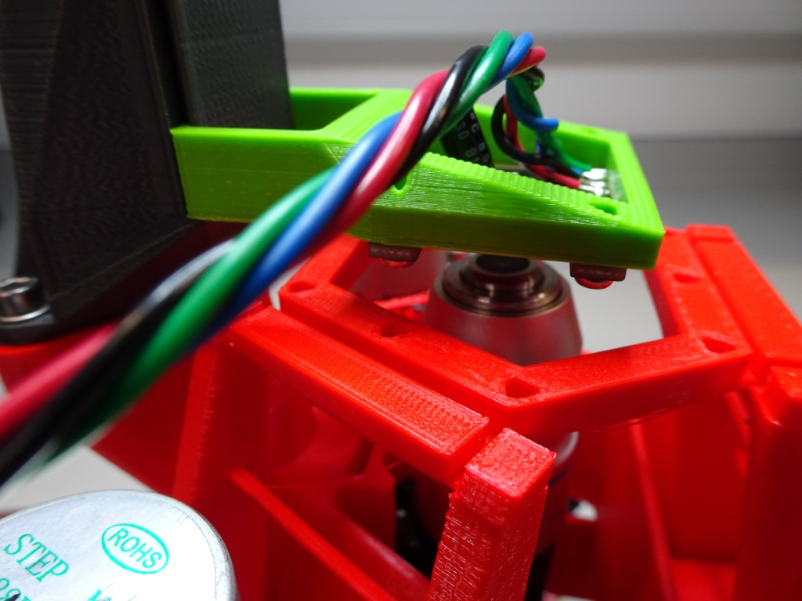
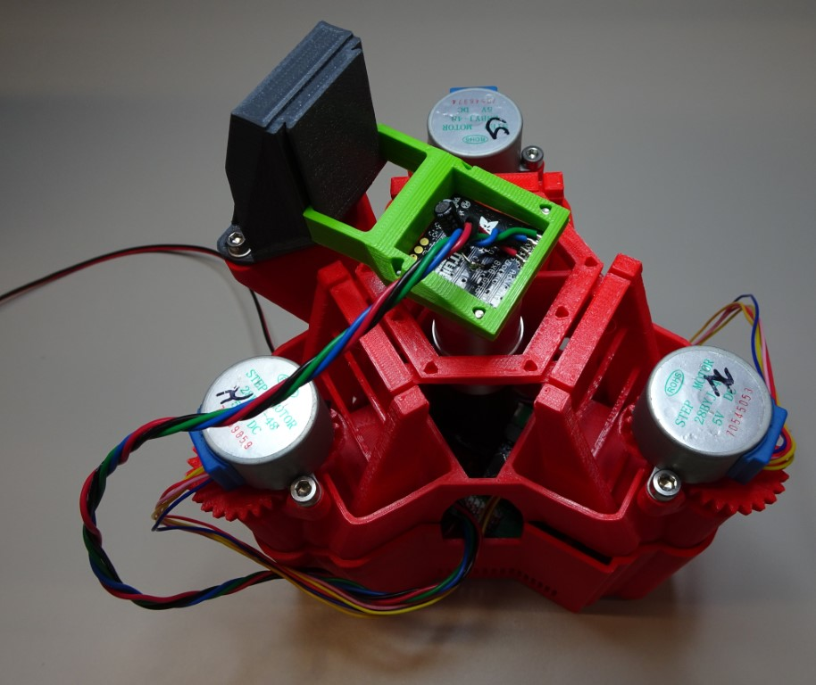

# LED grid illumination

Using a LED grid for illumination opens up new imaging modalities, such as darkfield, Rheinberg and phase imaging.  These instructions, behaving as an add on for the standard build, show you how to use a LED grid with the OpenFlexure Delta Stage. 

>This module is still under test, and requires some electronics experience, so please proceed with caution.  

{{BOM}}

[Adafruit 3444 LED grid]: models/LED_grid.md "{cat:part}"
[perma-proto board]: models/perma-proto_board.md "{cat:part}"
[74AHCT125]: models/74AHCT125.md "{cat:part}"
[USB cable]: models/USB_cable.md "{cat:part}"
[soldering iron]: "{cat:tool}"
[solder]: "{cat:part}"
[M2.5x8mm]: "{cat:part}"
[USB plug]: models/USB_plug.md "{cat:part}"
[LED array holder]: models/LED_array_holder.stl "{cat:3DPrinted}"
[M2.5x12mm standoffs]: models/12mm_standoffs.md "{cat:part}"
 [2mm hex screwdriver]: "{cat:tool}"

# Hardware

## Solder the parts {pagestep}

Solder the [Adafruit 3444 LED grid]{qty:1} to the [perma-proto board]{qty:1} with the [74AHCT125]{qty:1} chip using a [soldering iron]{qty:1} and [solder]{qty:some}.  You will need to power the LED grid, we recommend using a [USB cable]{qty:1} with a high power (2A) [USB plug]{qty:1} for convenience. 

Please make reference to the [fritzing diagram](fritzing/LED_grid.fzz).  Of course, you can always try it out with a breadboard before soldering to the perma-proto board.

## Attach the LED grid to the holder {pagestep}

Pass the [Adafruit 3444 LED grid] through the [LED array holder]{qty:1}. Secure it in place with four [M2.5x8mm screws]{qty:4} using a [2mm hex screwdriver]{qty:1}.

## Put the Raspberry Pi in the base {pagestep}

As with the [Raspberry Pi & Sangaboard base instructions](raspi_sangaboard_base.md), put the Raspberry Pi in the Raspberry Pi and Sangaboard base.  Secure it in place with four [M2.5x12mm standoffs]{qty:4}.

## Put the perma-proto HAT board on top of the Raspberry Pi {pagestep}

Push the [perma-proto board] on top of the Raspberry Pi.  Make sure the GPIO pins align with the header on the perma-proto board. The camera ribbon cable should fit through the slot.  Secure it in place with four [M2.5x12mm standoffs]{qty:4}.

## Put the Sangaboard on top of the perma-proto HAT {pagestep}

The Sangaboard (currently v2 only) should sit on top of the standoffs, and can be secured with four [M2.5x7mm screw]{qty:4}s using a [2mm hex screwdriver]{qty:1}.

## Complete microscope as usual and put the main body on the top {pagestep}

The rest of the [Raspberry Pi & Sangaboard base instructions](raspi_sangaboard_base.md) will guide you with putting the microscope together. The LED grid slots on the illumination dovetail.  You should not power the LED grid from the Raspberry Pi, instead power it using the high power (2A) [USB plug].

# Software

## Enable SPI

You may need to [enable SPI](https://www.raspberrypi-spy.co.uk/2014/08/enabling-the-spi-interface-on-the-raspberry-pi/) on your microscope.

## Download the extensions

You will need to download our extensions to your microscope to control the LED using the microscope's software.  The instructions to do this can be found on the [GitLab repository](https://gitlab.com/openflexure/microscope-extensions/led-grid-illumination-extension/-/tree/master).

