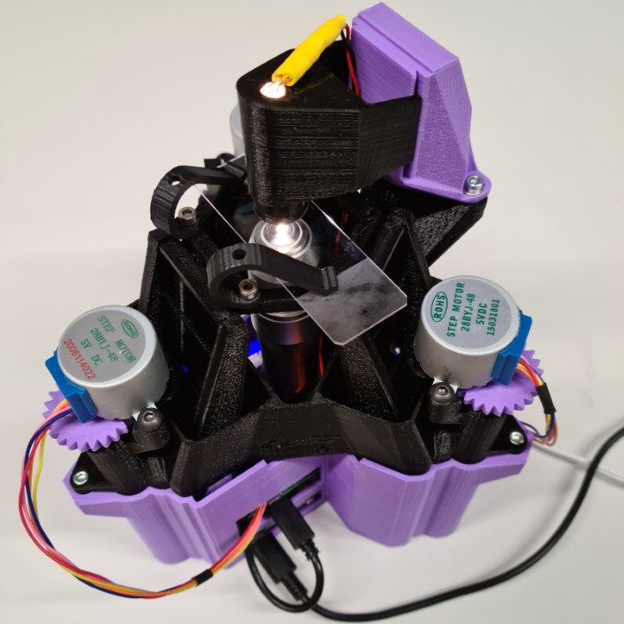
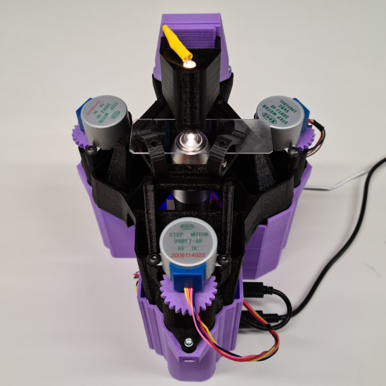
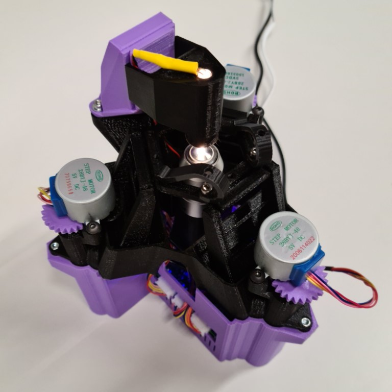

# OpenFlexure Delta Stage

The delta stage is a 3D printed x-y-z translation stage. As the optics do not move it is particularly suited to more complex imaging (phase, reflection, fluorescence microscopy).  There are two standard ways to build it, with either transmission illumination or reflection illumination.  The motorised translation stage, which forms the main body of the microscope, is the same for both, and so swapping between the two configurations is possible by replacing the optics module.  There are also some optional components linked at the bottom of the page.

## Printing guidance

We normally print with PLA using a 0.15 layer height and ~18% infill. You should not need to print any of the parts with adhesion settings (brim etc.) or supports.  Take note of the optics parts we recommend you print with black PLA, to reduce stray light.

## Building the Delta Stage
There are two versions of the instructions:

* [Delta stage microscope with transmission illumination](pages/index_transmission.md)
* [Delta stage microscope with reflection illumination](pages/index_reflection.md)

### Optional components

* [LED Grid illumination](pages/LED_grid_illumination.md): For more complex illumination.
* [Simple base](pages/simple_base.md):  Short base; matches the footprint of the OpenFlexure Delta stage.
* [Stage adapters](pages/stage_adapters.md): Adapters for the stage to holder different components.

### Software

You can control your microscope using the [OpenFlexure software](https://openflexure.org/projects/microscope/install). The geometry of the Delta Stage is different to the standard OpenFlexure Microscope.  So that the movement of the stage is correct, you will need to change the stage configuration:

1. In OpenFlexure Connect, when connected to your Delta Stage microscope, click `Settings`.
2. Under `MICROSCOPE SETTINGS`, click `Stage`.
3. Change the `Stage geometry` dropdown to `SangaStage (Delta)`.
4. Click `CHANGE STAGE GEOMETRY`.

