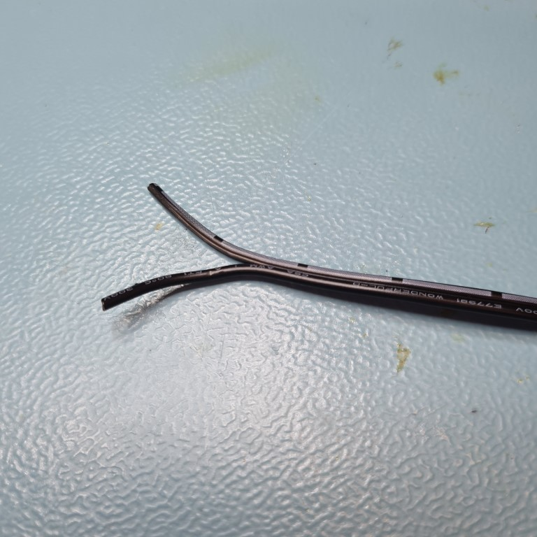
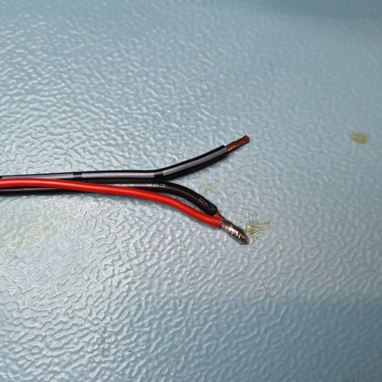
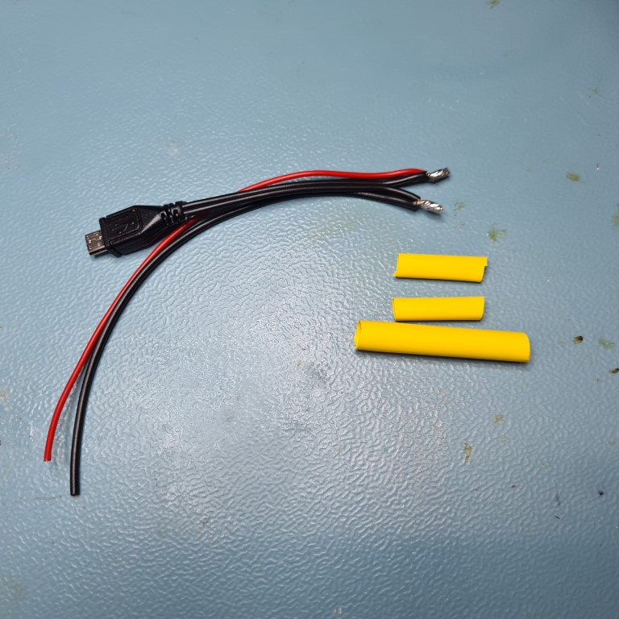
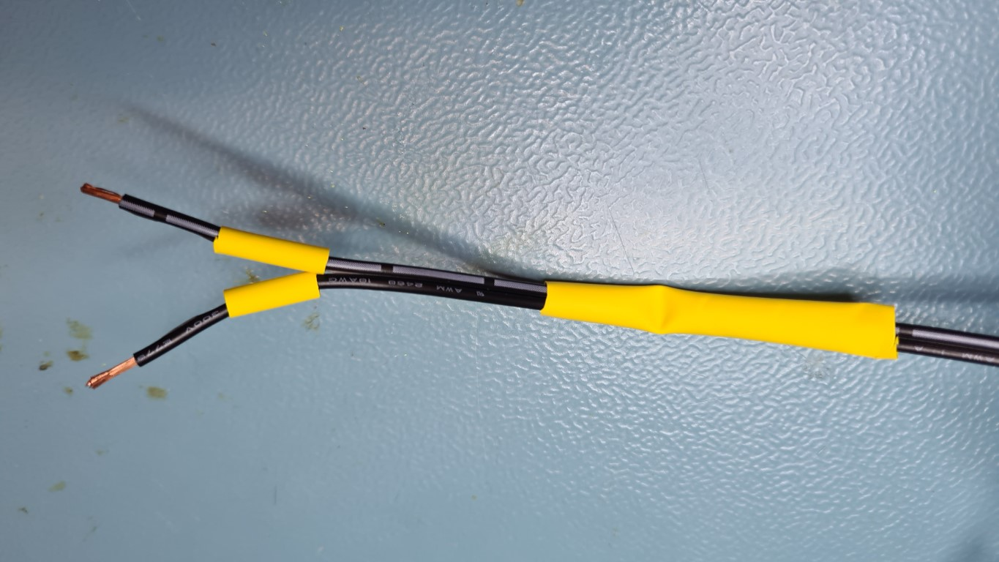
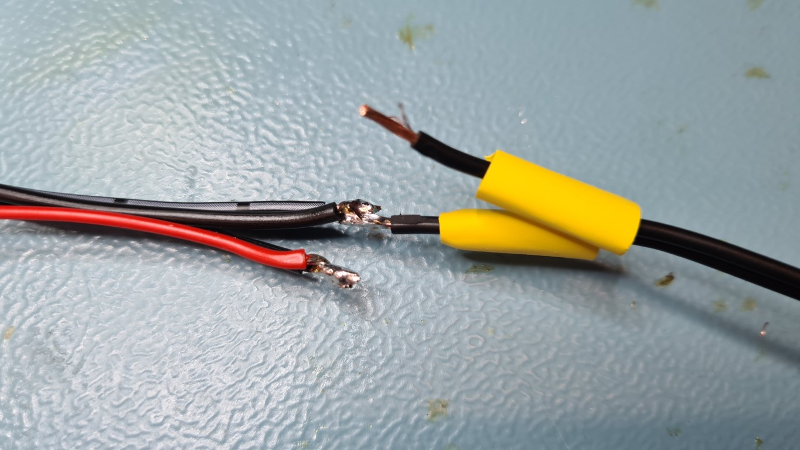
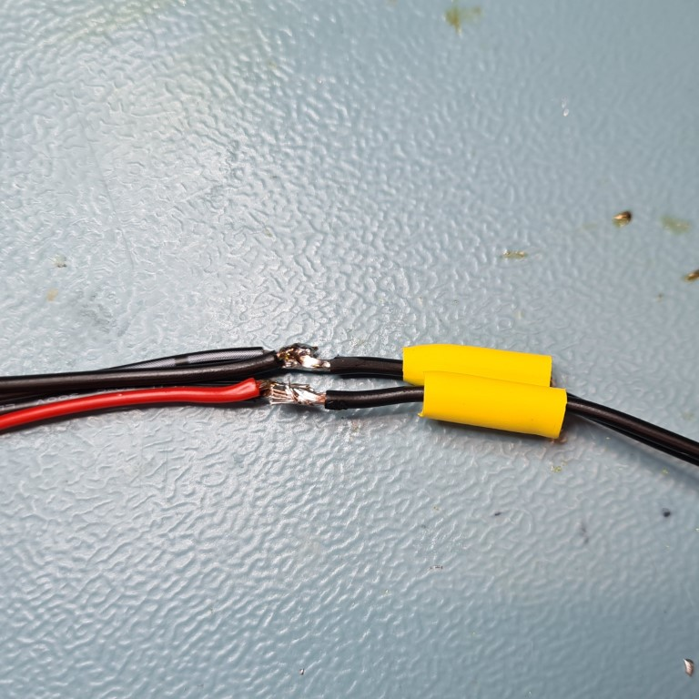
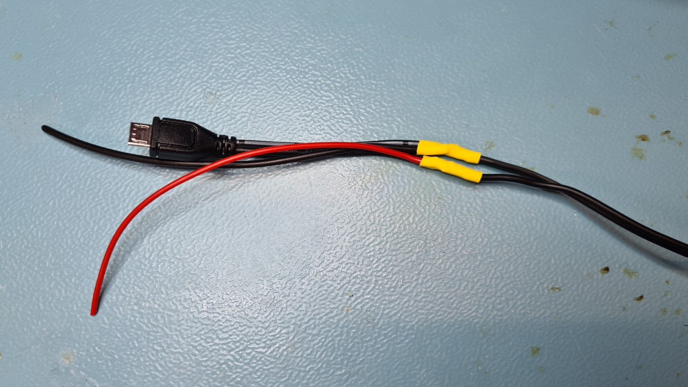
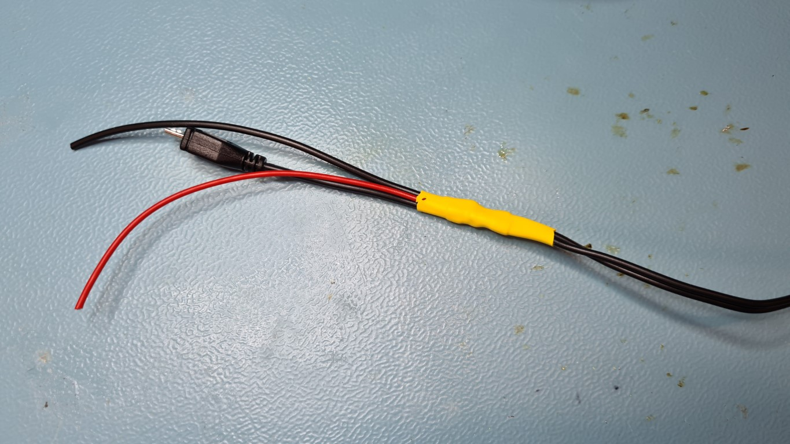

# Motor controller (Sangaboard)

The stage can be powered by a Raspberry Pi and a motor controller.

{{BOM}}

[Raspberry Pi power supply]: models/raspi_power.md "{cat:part}"
[red power wire]: models/power_wire.md#red "{cat:part}"
[black power wire]: models/power_wire.md#black "{cat:part}"
[4.8mm heat shrink]: models/4_8mm_heat_shrink.md "{cat:part}"
[6.4mm heat shrink]: models/6_4mm_heat_shrink.md "{cat:part}"
[soldering iron]: "{cat:tool}"
[wire stripper]: "{cat:tool}"
[craft knife]: "{cat:tool}"
[heat gun]: "{cat:tool}"
[wire cutters]: "{cat:tool}"

## Method

### The Sangaboard {pagestep}

[These instructions](https://build.openflexure.org/openflexure-microscope/v6.1.2/docs/#/6_motor_controllers) show the different ways of controlling the motors. The base currently works best with the Sangaboard v2.

### Powering the motors {pagestep}

Do not power the motors from the pins on the Raspberry Pi.  Instead split the [Raspberry Pi power supply] cable.  

Cut the [Raspberry Pi power supply]{qty:1} cable approximately 20cm from the USB plug end using [wire cutters].

Carefully separate the two cables using a [craft knife]{qty:1} on the USB plug cable for approximately 3cm and strip both wires using a [wire stripper]{qty:1}. Check which wire is positive and negative.  On this official [Raspberry Pi power supply] cable, the wire with long lines printed on is the negative wire.

Cut a 20cm length of [red power cable]{qty:1} and [black power cable]{qty:1} using [wire cutters]. Strip one end using a [wire stripper]. Wrap the red wire around the positive wire of the [Raspberry Pi power supply] cable. Solder in place with a [soldering iron]{qty:1} and [solder]{qty:some}.

Repeat for the [black power cable] on the negative wire of the [Raspberry Pi power supply] cable.

Cut two [4.8mm heat shrink]{qty:6cm} tubes approximately 3cm long.  Cut one [6.4mm heat shrink]{qty:6cm} tube approximately 6cm long.

Carefully separate the two cables using a [craft knife]{qty:1} on the longer end of the [Raspberry Pi power supply cable] for approximately 5cm and strip both wires using a [wire stripper]. Push the longer [6.4mm heat shrink] tube over both wires and the two shorter [4.7mm heat shrink] tubes over each of the wires.

Wrap the negative wire from the longer cable with the already soldered negative wire from the USB end.  Solder in place with a [soldering iron]{qty:1} and [solder]{qty:some}.

Repeat for the positive wire.

Move the two [4.8 heat shrink] tubes over the joints and heat in place using a [heat gun]{qty:1} or [soldering iron]{qty:1}.

Move the [5.6mm heat shrink] tube over both joints and heat in place using a [heat gun]{qty:1} or [soldering iron]{qty:1}.

You can then attach the connector of your choice to connect to the Sangaboard.

