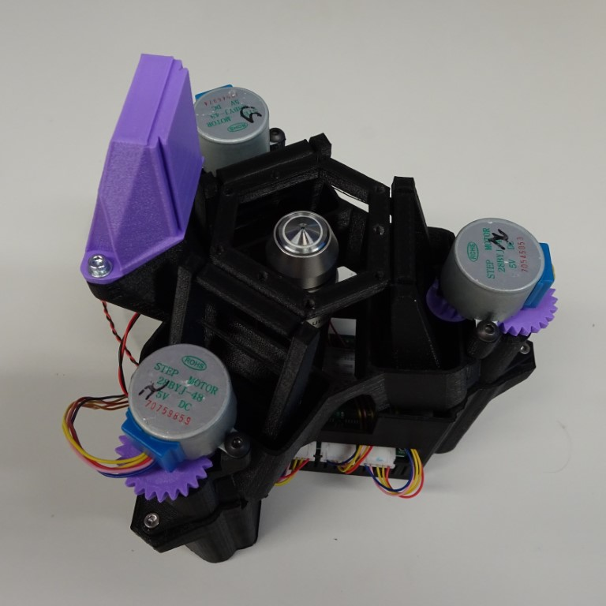
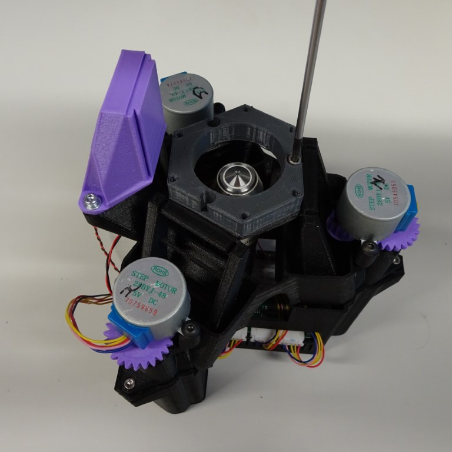
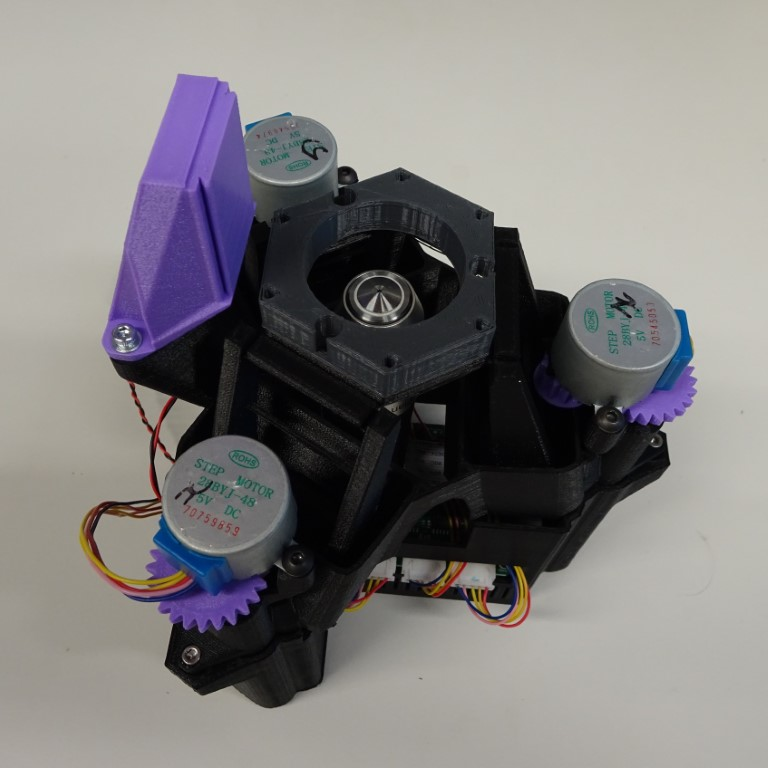
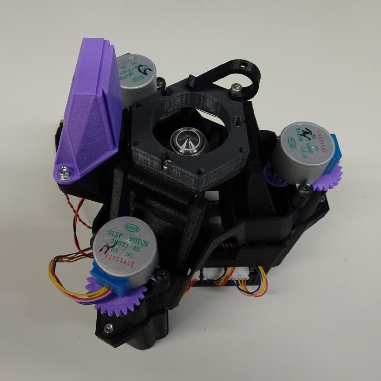
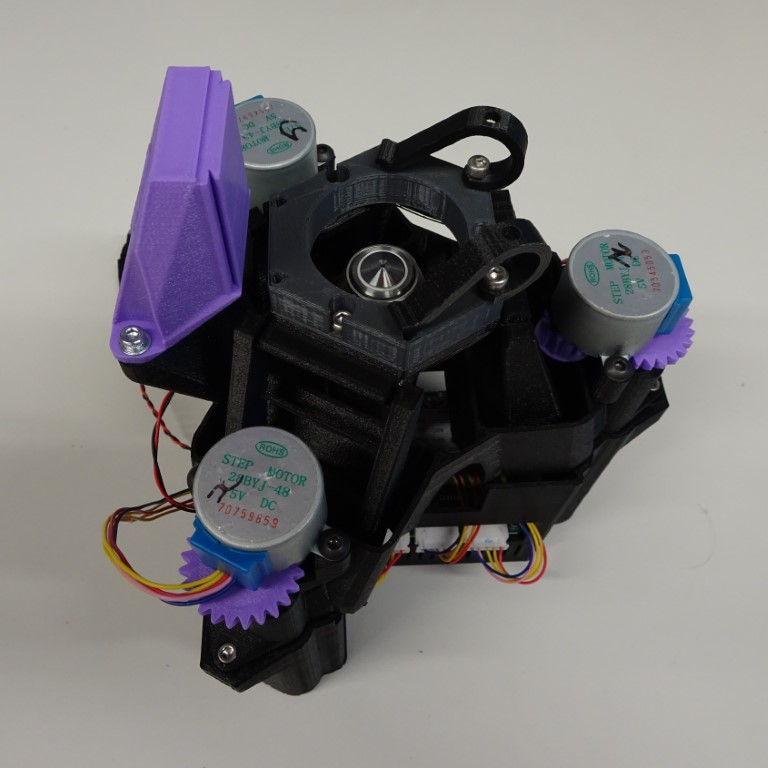

# 10mm Stage riser

This raises the stage up by 10mm, for longer objective lenses on the OpenFlexure Delta Stage

{{BOM}}

[10mm riser]: ../models/10mm_riser.stl "{cat:3DPrinted}"
[M3x86mm screw]: "{cat:part}"
[main body]: ../components/delta_stage_main_body.md "{cat:3DPrinted}"
[2.5mm hex screwdriver]: "{cat:tool}"
[sample clip]: ../models/sample_clips.stl "{cat: 3DPrinted, note: Both sample clips are in the one file.}"

# Method

## Attach the petri dish holder to the stage {pagestep}

Screw the [10mm riser]{qty:1} to the [main body] with three [M3x6mm screw]{qty:3}s using a [2.5mm hex screwdriver]{qty:1}.

## Attach the sample clips {pagestep}

Screw the [sample clip]{qty:2}s to the [10mm riser] using two [M3x6mm screw]{qty:2}s using a [2.5mm hex screwdriver]{qty:1}.

