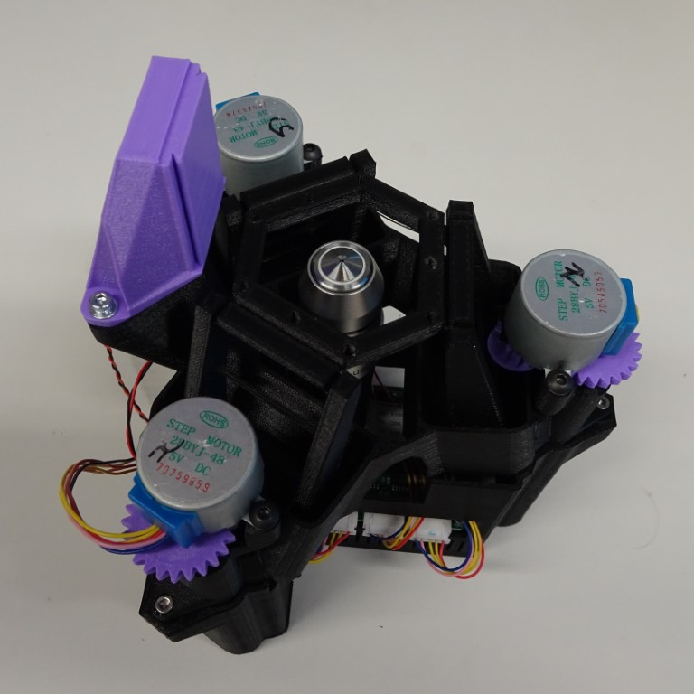
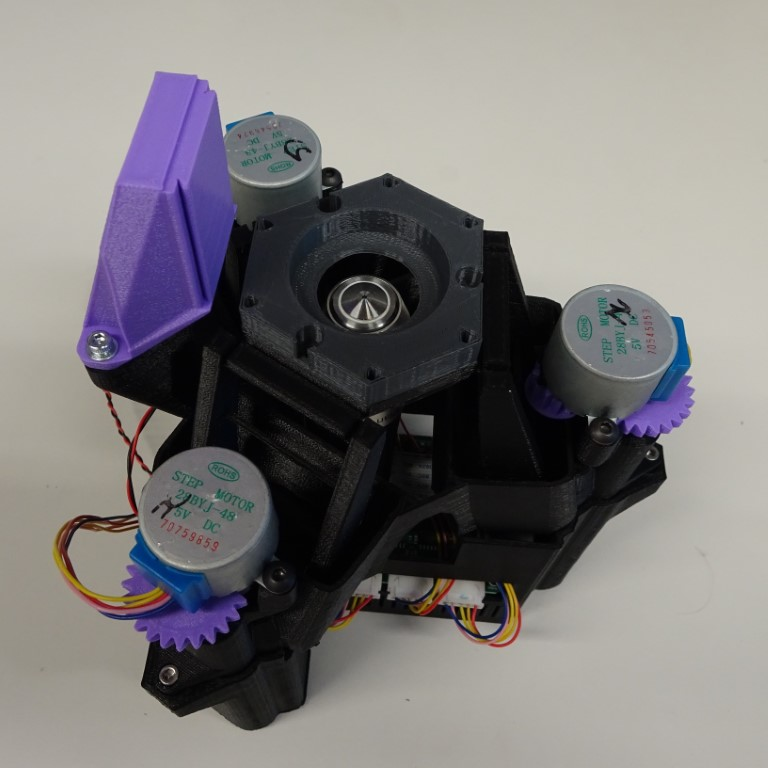
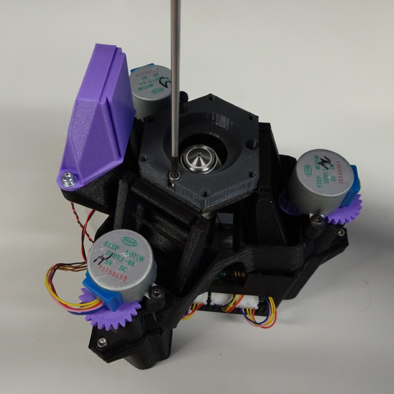
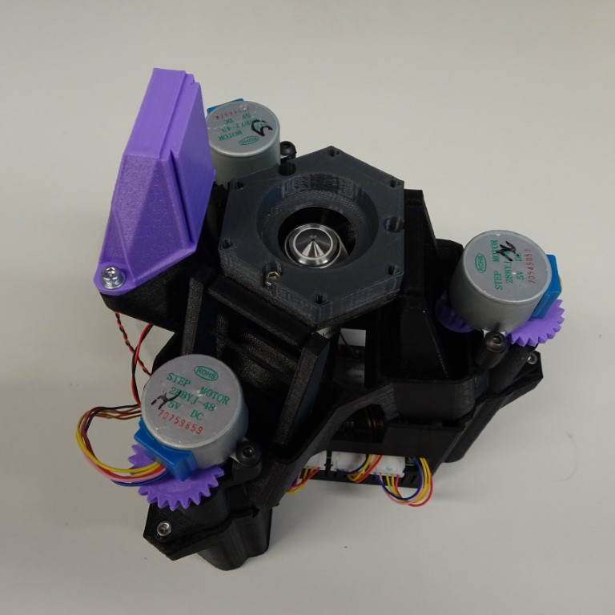
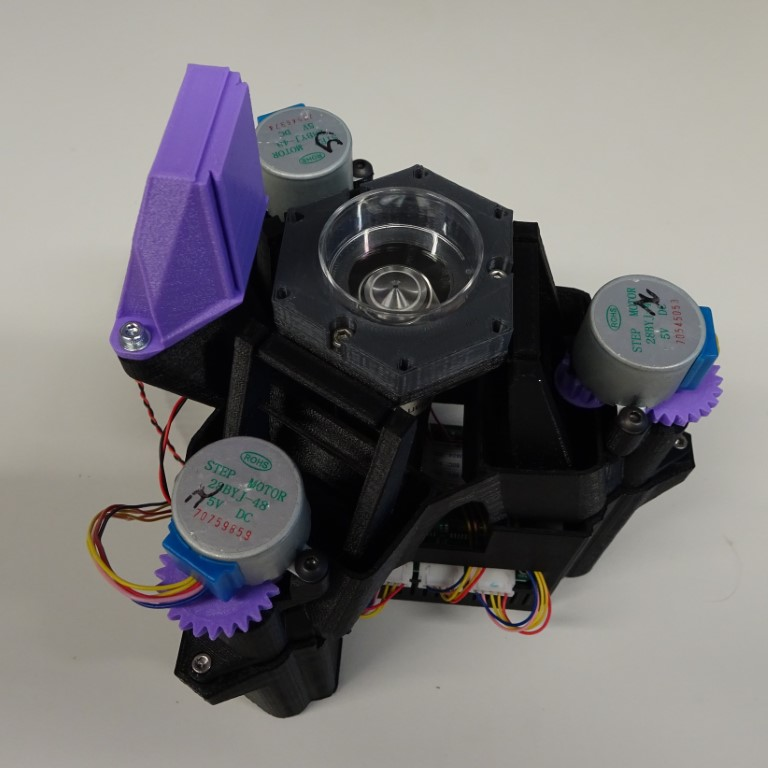

# 35mm Petri dish holder

This holds a 35mm Petri dish firmly on top of the stage for the OpenFlexure Delta Stage

{{BOM}}

[35mm petri dish holder]: ../models/35mm_petri_dish_holder.stl "{cat:3DPrinted}"
[M3x8mm screw]: "{cat:part}"
[main body]: ../components/delta_stage_main_body.md "{cat:3DPrinted}"
[2.5mm hex screwdriver]: "{cat:tool}"

## Method

### Attach the petri dish holder to the stage {pagestep}

Screw the [35mm petri dish holder]{qty:1} to the [main body] with three [M3x6mm screw]{qty:3}s using a [2.5mm hex screwdriver]{qty:1}.  

### Push in the petri dish {pagestep}

The petri dish has a tight fit, and its lid can also be put on.

