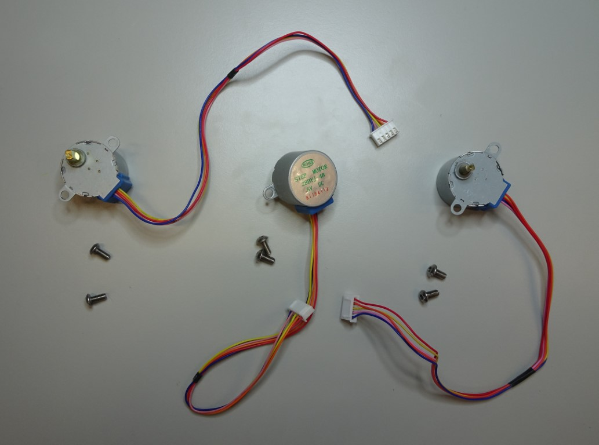
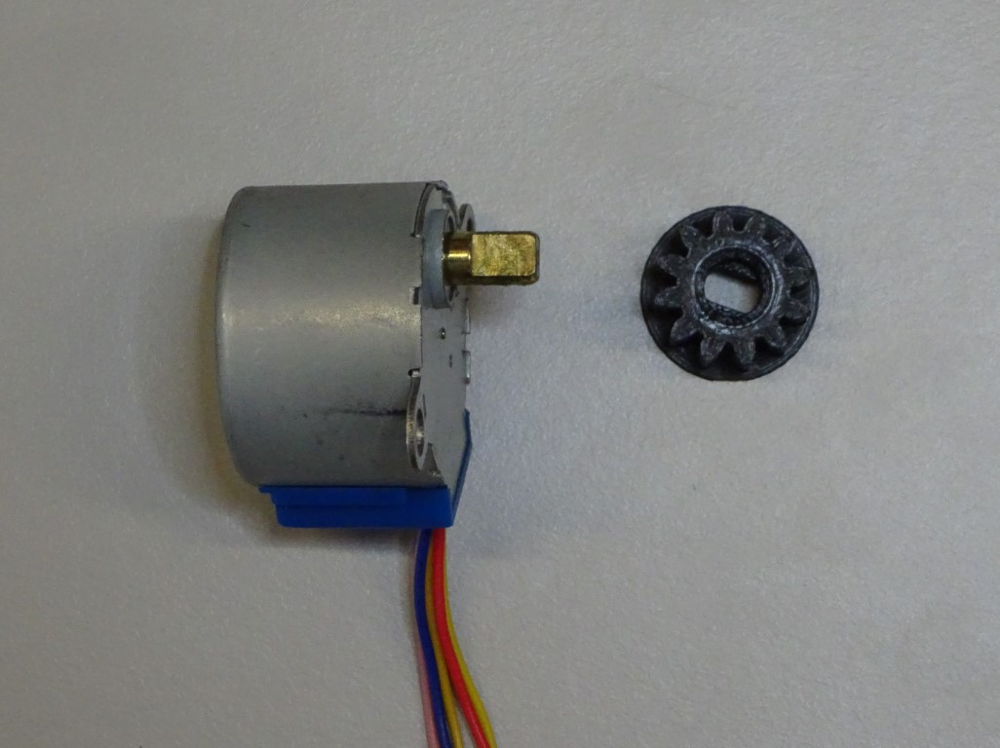
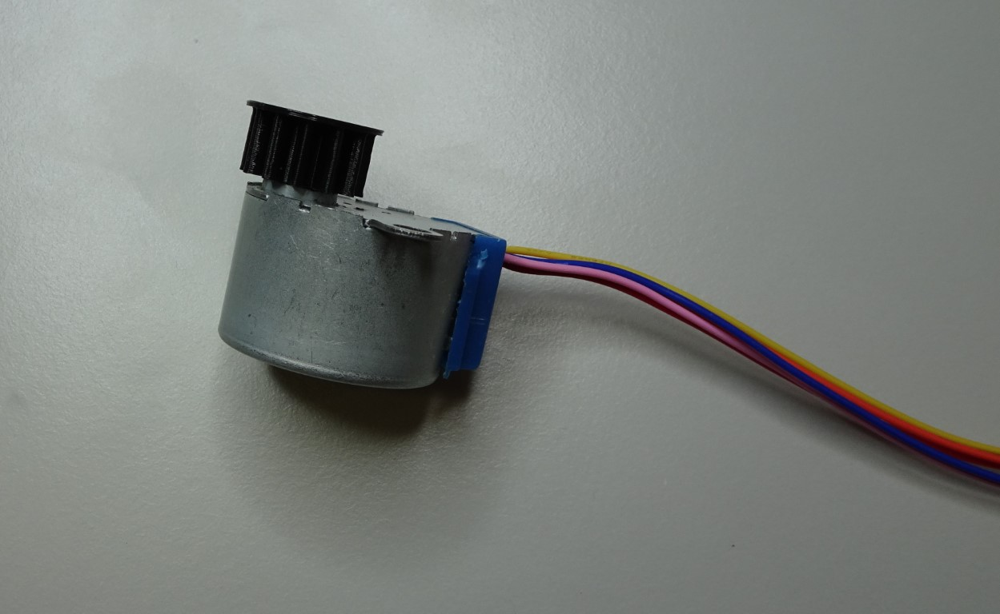
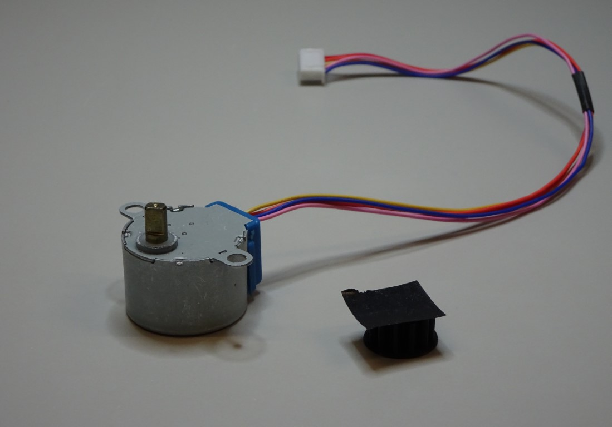
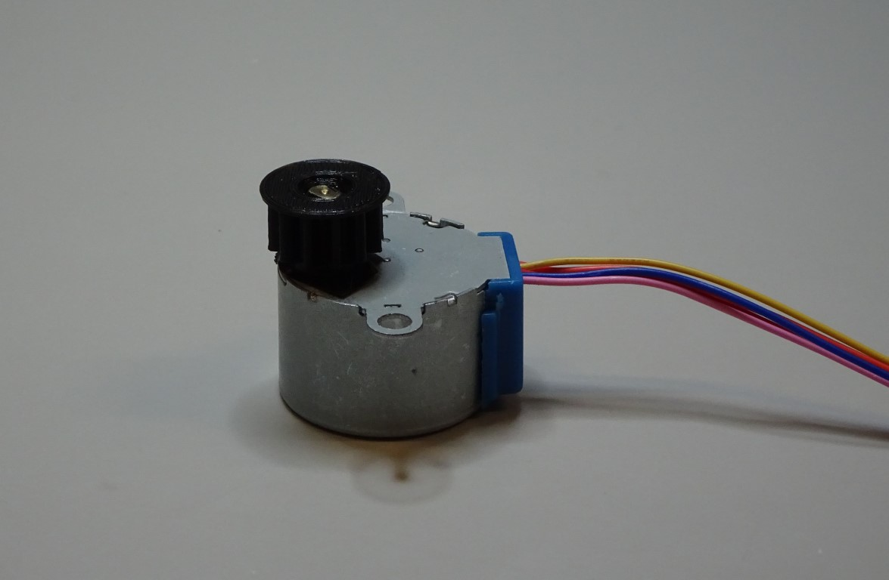
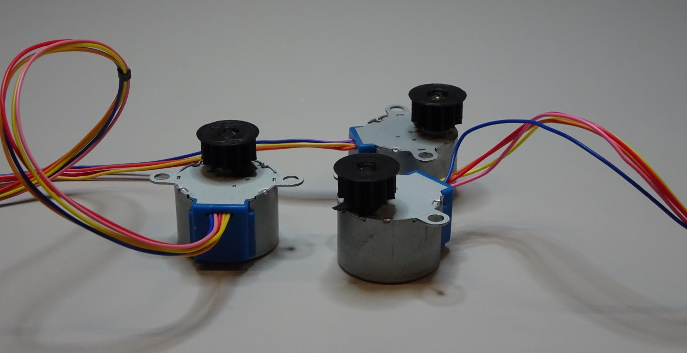
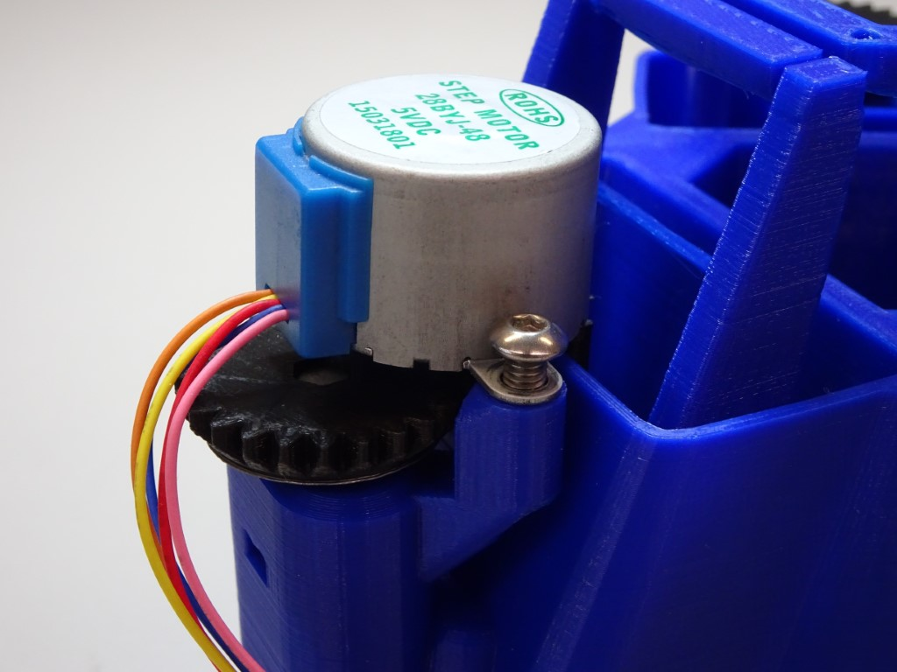
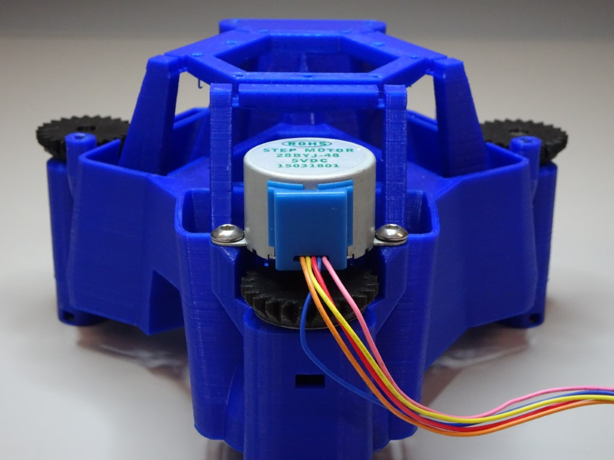
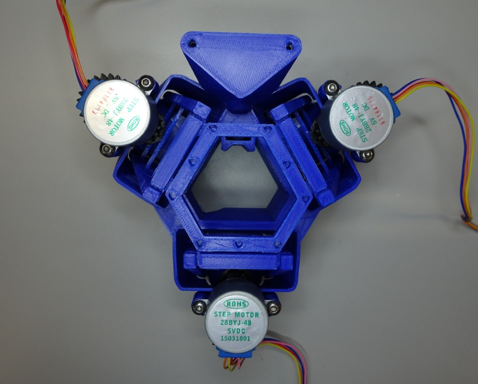

# Attaching the motors

If you want your stage to be automated, these instructions will show you how to attach the motors to the stage.

{{BOM}}

[small gear]: ../models/small_gears.stl "{cat: 3DPrinted, note: All three gears are in the one file.}"
[28BYJ-48 micro geared stepper motor]: ../components/motor.md "{cat:part}"
[electrical tape]: "{cat:part}"
[M4x6mm button head screw]: "{cat:part}"

[2.5mm hex screwdriver]: "{cat:tool}"

# Method

## Insert the motor into the small gear {pagestep}
Put the [small gear]{qty:3} with its circular side down. Put one [28BYJ-48 micro geared stepper motor]{qty:3} through the hole of the gear.  The hole isn't circular so the motor shaft will need to be lined up correctly.  

This should be a tight fit, if it is not then take the gear off and place some [insulating tape]{qty:some} on the top of the gear - sticky side up. Push the shaft into the tape and through the hole.

Repeat for all three motors.

## Attach the motor to the microscope {pagestep}

Line up the motor so that the small gear is between the large gear and the stage leg. The motor's mounting holes should line up with the motor legs. Screw one [M4x6mm button head screw]{qty:6} through the motor's mounting hole onto the leg using a [2.5mm hex screwdriver]{qty:1}.

Screw another M4 screw through the mounting hole and onto the leg.  Make sure both screws are done up tightly so that the motor cannot wobble.

Repeat for all three motors.

