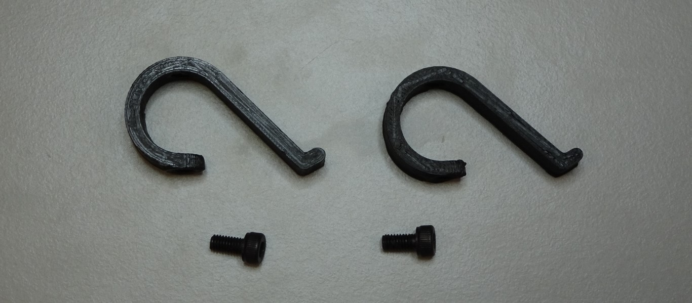
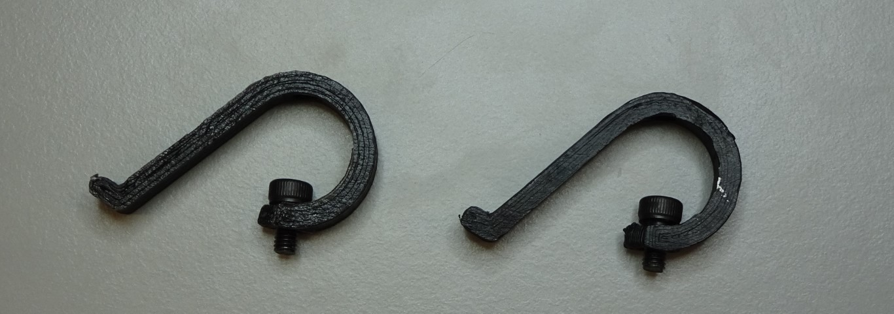
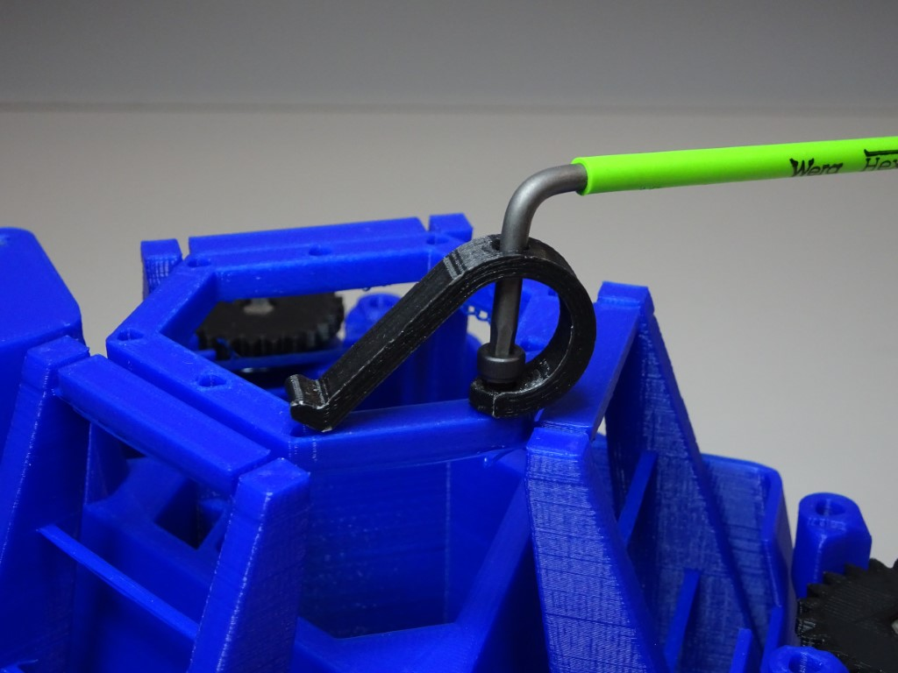
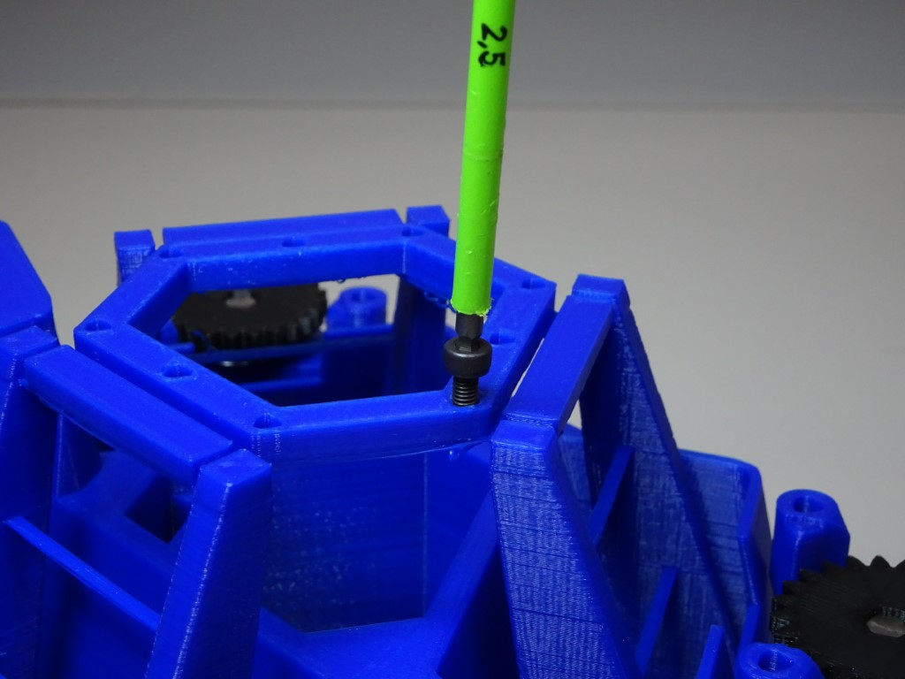
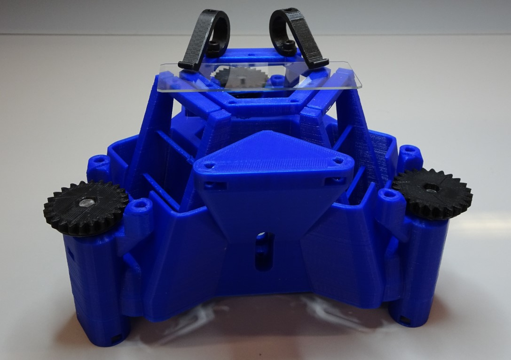

# Attaching the sample clips

To securely hold a microscope slide on the stage, you can attach the sample clips.

{{BOM}}

[sample clip]: ../models/sample_clips.stl "{cat: 3DPrinted, note: Both sample clips are in the one file.}"
[M3x6mm screw]: "{cat:part}"

[2.5mm hex screwdriver]: "{cat:tool}"

# Method

## Insert the screws into the clips {pagestep}

Push the two [M3x6mm screw]{qty:2}s through the lower hole of the [sample clip]{qty:2} using a [2.5mm hex screwdriver]{qty:1}.

## Screw the sample clips onto the stage {pagestep}

There are 9 holes on the top of the stage, allowing you flexibility when choosing where to place the sample clips. Screw the sample clip to the stage, going through the hole at the top.  

If it is difficult to start screwing, then you may find it useful to tap the hole with the screw first.

Attach the second clip in the same way.

## Clamp the slide {pagestep}

Now you can gently lift up the glass clips and place your microscope slide.

