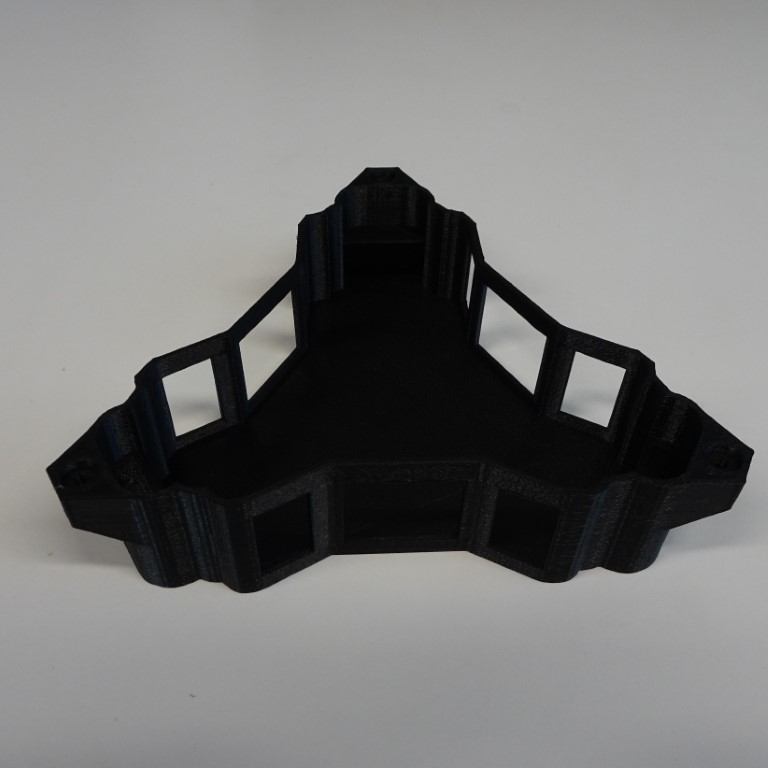
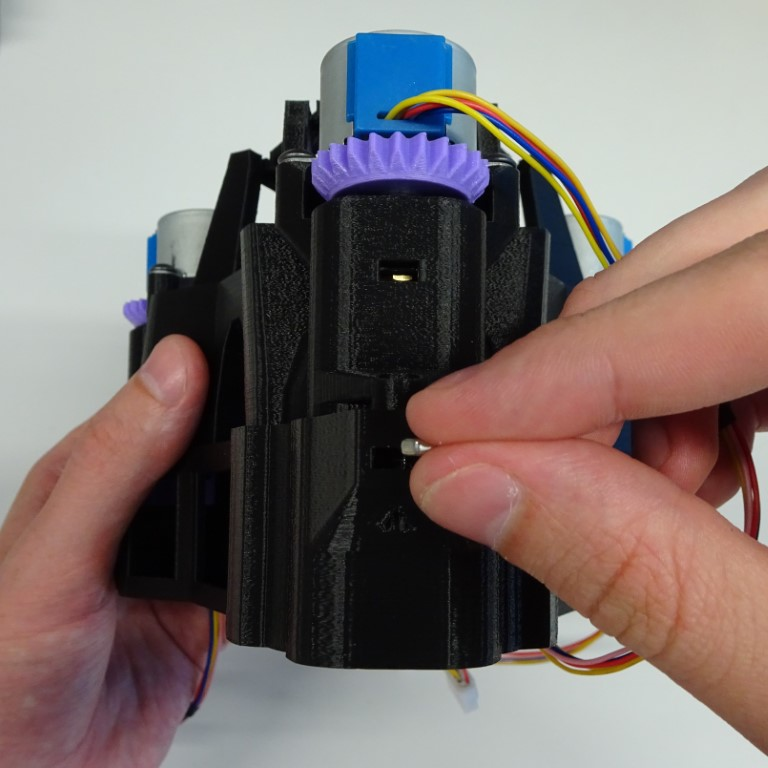
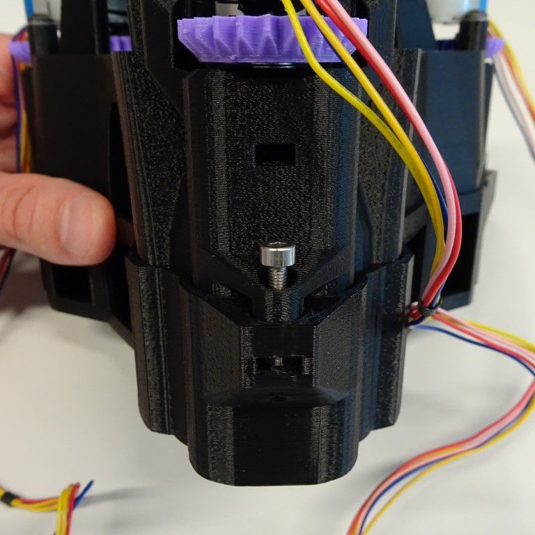
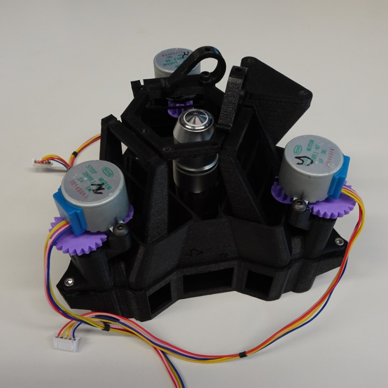

# Simple base

{{BOM}}
[simple base]: ../models/simple_base.stl "{cat: 3DPrinted}"
[M3x12mm screw]: "{cat:part}"
[M3 nut]: "{cat:part}"
[2.5mm hex screwdriver]: "{cat:tool}"
[main body]: ../components/delta_stage_main_body.md "{cat:3DPrinted}"
## Method

### Put microscope into base {pagestep}

The microscope [main body] fits tightly into the [simple base].

### Secure the microscope to the base {pagestep}

Insert one [M3 nut]{qty:3} into the nut trap in the base.  It may be necessary to clear out the hole of printing artefacts.  

Insert one [M3x12mm screw]{qty:3} into the hole in the microscope [main body].  Screw it in place using a [2.5mm hex screwdriver]{qty:1}.

Repeat for the other two base connectors.

