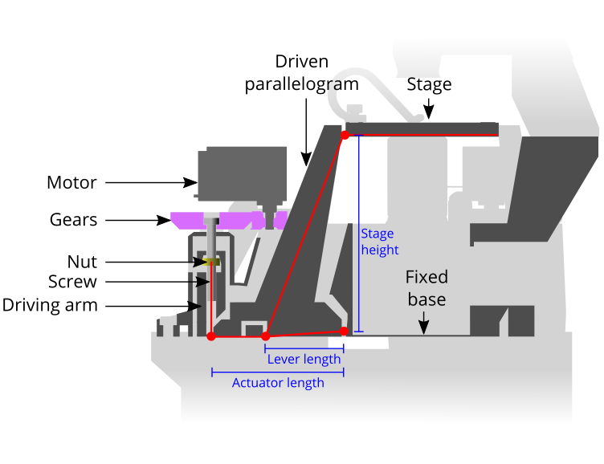

# Stage mechanism notes

## Flexure geometry

The flexure geometry used is the same as that reported in [Sharkey et al](https://doi.org/10.1063/1.4941068), which sets the thickness of the flexure to three layers of plastic (the minimum for strong, reliable prints) and the length of the flexures to 1.5mm.  The flexure length is a compromise between deflection range and stiffness, and with the height used, it allows about 6 degrees of motion without exceeding the elastic limit.

## Stage geometry

The geometry of the stage trades off travel, accuracy, and overall size.  The horizontal travel is set by the stage height.  The stage height (``flex_z2``) of 70mm is a compromise between overall height of the structure (which affects stiffness and print reliability) and travel (which increases with a taller stage).  Increasing to around 100mm is possible, and the parametric OpenSCAD design allows for this, though it is not frequently tested.  

The vertical travel is set by the lever length  (``lever_l``), i.e. The distance from the central pivot to the point where the legs attach to the actuator levers.  This is geared down from the motion of the driving nut, by the ratio of the distances between the two outer pivots and the inner (static) pivot.  There is little to gain in most applications from a smaller step size in Z, so the two outer pivots are as close as they can be, without interfering with the actuator mechanism.  

The number of motor steps across the range of travel is set by the length of the actuating lever (``nut_y``), and so making this lever longer trades precision for speed.  There is little advantage in making smaller steps for most applications, but attempting to increase the speed by mechanical amplification will adversely affect stiffness; the current geometry is similar to the OpenFlexure Microscope, as this appears empirically to be a good compromise between range and stiffness.
