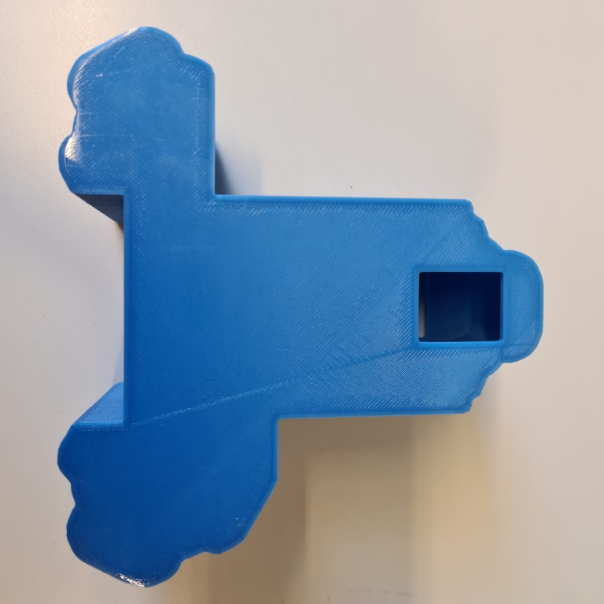
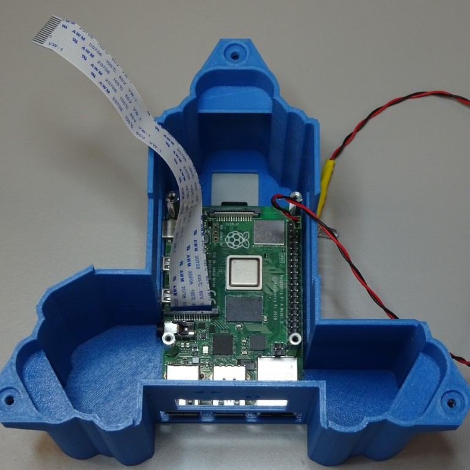
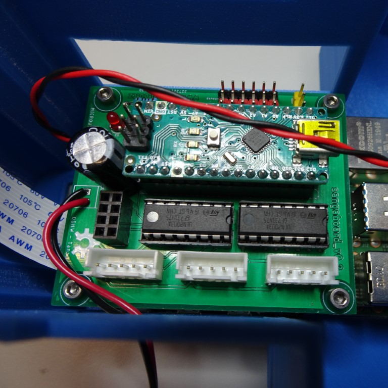
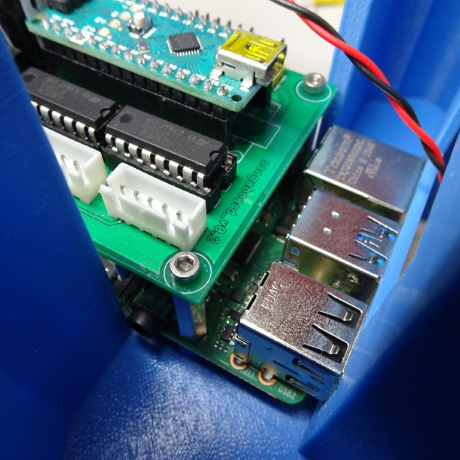
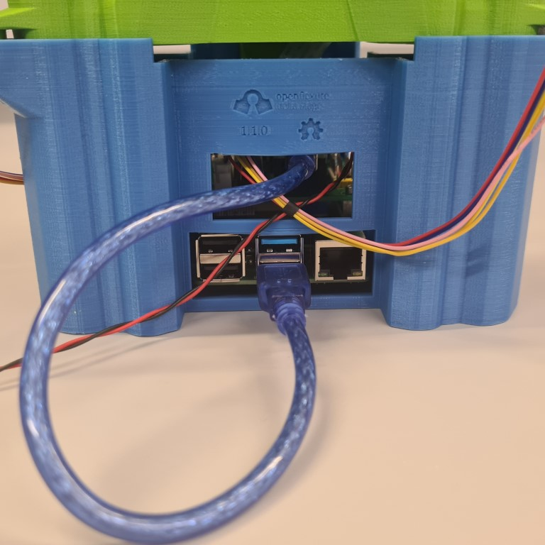
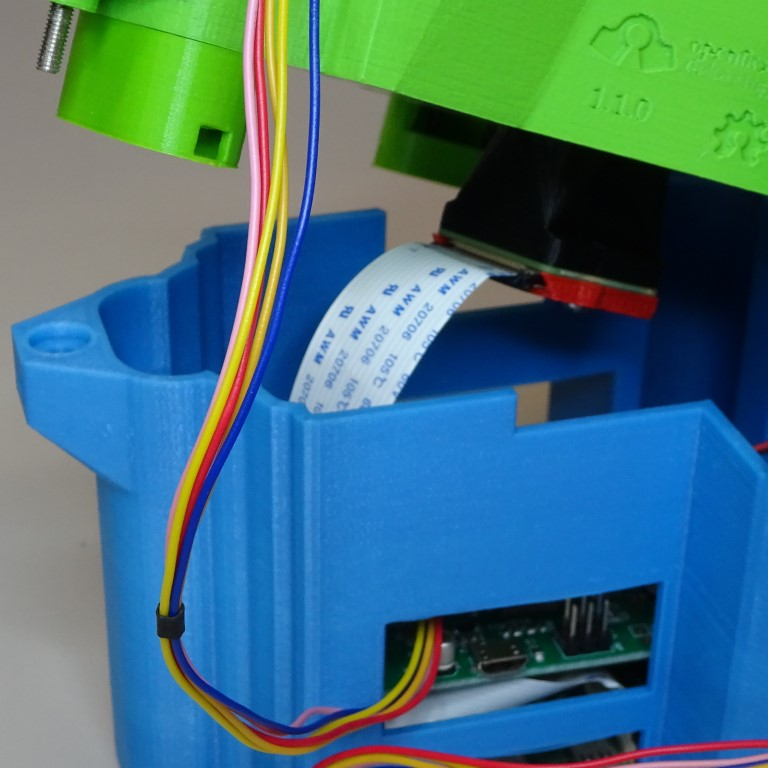

# Raspberry Pi and Sangaboard base

This base fits both the Raspberry Pi (Models B+, 3B, 3A+, 3B+, 4B) and the Sangaboard v2, with holes for the wires and connections and space for an optics module to move.

>**Warning:** Make sure your SD card is flashed with the [OS and software](index.md#Software) and inserted into your Raspberry Pi as it is not easily accessible once the base is completed.

{{BOM}}

[Raspberry Pi & Sangaboard base]: models/base_raspi_sangaboard.stl "{cat: 3DPrinted}"

[M2.5 20mm standoffs]: standoffs.md "{cat:part}"
[Sangaboard]: "{cat:part}"

[small pliers]: "{cat:tool}"
[SW5 nut driver]: "{cat:tool}"
[M2 screwdriver]: "{cat:tool}"

## Method

### Base stabilisation {pagestep}

You may wish to add [rubber feet]{qty:3} to your [Raspberry Pi & Sangaboard base]{qty:1} for stability.

Alternatively, you could drill holes in the bottom of the base to attach it to an optical bench.

### Add Raspberry Pi {pagestep}

If you haven't already [connected the camera ribbon cable and LED](./connecting_the_electronics.md), then do this now.

Place the Raspberry Pi into the bottom of the case.  Screw the four [M2.5 20mm standoffs]{qty:4} through the holes of the Raspberry Pi (hand tight or using [small pliers]{qty:1} or [SW5 nut driver]{qty:1}, being careful not to over-tighten) and into the base.  You may find it easier to tap the holes with M2.5 screws before.

### Add Sangaboard {pagestep}

Place the [Sangaboard]{qty:1} on top of the standoffs, making sure the cables from the Raspberry Pi have space. Screw the [M2.5 7mm screws]{qty:4} using a [M2 screwdriver]{qty:1} through the holes of the Sangaboard into the standoffs.  You might find it easier to attach all four loosely, then tighten them together.  Be careful not to over-tighten these screws.

### Plug in motors {pagestep}

Plug in the motors ([already attached to the stage](./attaching_the_motors.md)).  Two of the motor cables can enter though the window in the side of the case and the other one can enter through the fluorescent illumination cutout.

Coming soon: the correct order to plug in the motors.

### Connect the Sangaboard {pagestep}

The Sangaboard connects to the Raspberry Pi by USB cable. There is a special window for the USB cable to pass through.

### Attach the camera ribbon cable {pagestep}

If you are using the [transmission](./transmission_illumination.md) or [reflection](./reflection_illumination.md) illumination, connect the ribbon cable to the camera module and attach it to the microscope as per those instructions.

### Put microscope into base {pagestep}

The microscope fits snuggly into the base.  Make sure the motor cables and LED cable exit through the gap and don't get trapped.

### Attach external components {pagestep}

There are windows around base to connect external components.  On the side there is space for USB power to the Raspberry Pi and Sangaboard and HDMI.

At the back there is space for USB components (for example: keyboard, mouse, memory stick) and ethernet.

