# Raspberry Pi and Sangaboard base

This base fits both the Raspberry Pi (Models B+, 2, 3B, 3B+, 4B) and the Sangaboard (v0.2 and v0.3), with holes for the wires and connections and space for an optics module to move.

>**Warning:** Make sure your SD card is flashed with the [OS and software](index.md#Software) and inserted into your Raspberry Pi.

{{BOM}}

[Raspberry Pi & Sangaboard base]: models/base_raspi_sangaboard.stl "{cat: 3DPrinted}"

[M2.5x20mm standoff]: models/20mm_standoffs.md "{cat:part}"
[M2.5x8mm screw]: "{cat:part}"
[M3x12mm screw]: "{cat:part}"
[Raspberry Pi]: models/raspberry_pi.md "{cat:part}"
[Sangaboard]: models/sangaboard.md "{cat:part}"
[USB cable]: models/sangaboard_USB_cable.md "{cat:part}"
[main body]: models/delta_stage_main_body.md "{cat:3DPrinted}"

[small pliers]: "{cat:tool}"
[SW5 nut driver]: "{cat:tool}"
[2mm hex screwdriver]: "{cat:tool}"
[2.5mm hex screwdriver]: "{cat:tool}"

## Method

### Base stabilisation {pagestep}

You may wish to add [rubber feet]{qty:3} to your [Raspberry Pi & Sangaboard base]{qty:1} for stability.

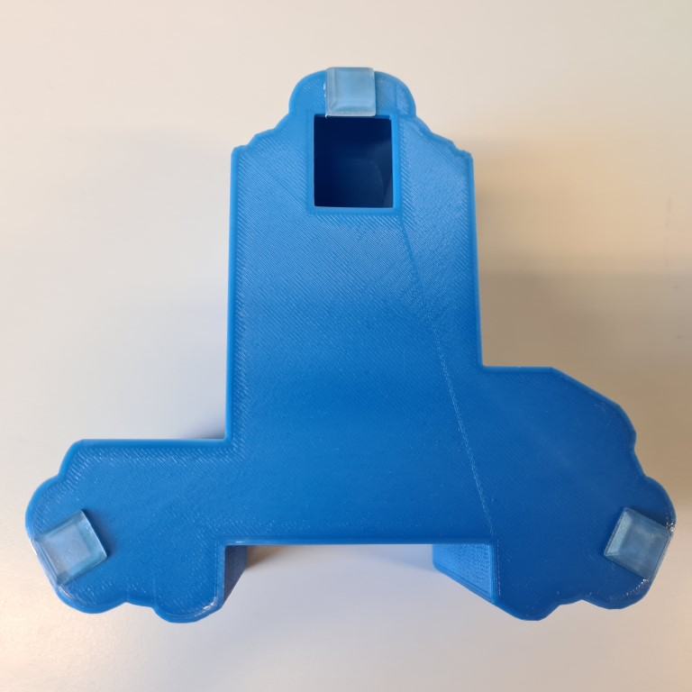

Alternatively, you could sit it on a layer of foam or drill holes in the bottom of the base to attach it to an optical bench.

### Add Raspberry Pi {pagestep}

Connect the camera ribbon cable and LED to the Raspberry Pi. The LED should connect with the positive (red) cable to the 5V pin (number 4) and the ground (black) cable to the Ground pin (number 6) on the [GPIO](https://www.raspberrypi.org/documentation/usage/gpio/).

Place the Raspberry Pi into the bottom of the case.  Screw the four [M2.5x20mm standoff]{qty:4}s through the holes of the Raspberry Pi (hand tight or using [small pliers]{qty:1} or [SW5 nut driver]{qty:1}, being careful not to over-tighten) and into the base.  You may find it easier to tap the holes with M2.5 screws before.

### Add Sangaboard {pagestep}

Place the [Sangaboard]{qty:1} on top of the standoffs, making sure the cables from the Raspberry Pi have space. The LED cable can exit the through the window at the back.  

#### Sangaboard v0.2

Screw the [M2.5x8mm screw]{qty:4}s using a [2mm hex screwdriver]{qty:1} through the holes of the Sangaboard into the standoffs. You might find it easier to attach all four loosely, then tighten them together. Be careful not to over-tighten these screws.

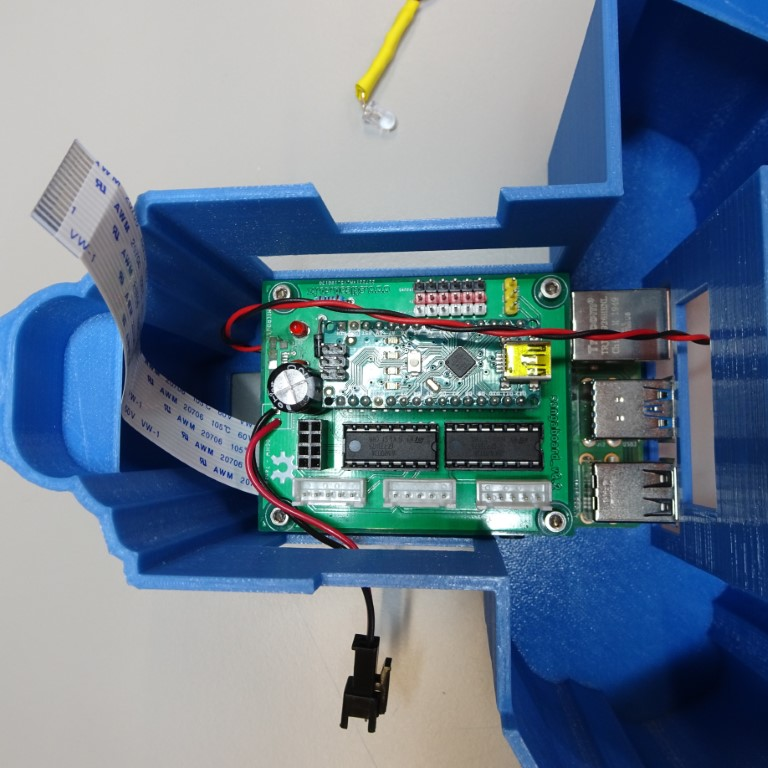

#### Sangaboard v0.3

You can attach this Sangaboard to the two standoffs closest to the GPIO with two [M2.5x8mm screw]s using a [2mm hex head screwdriver]{qty:1}.  It will sit (but not secured) on the other two standoffs.

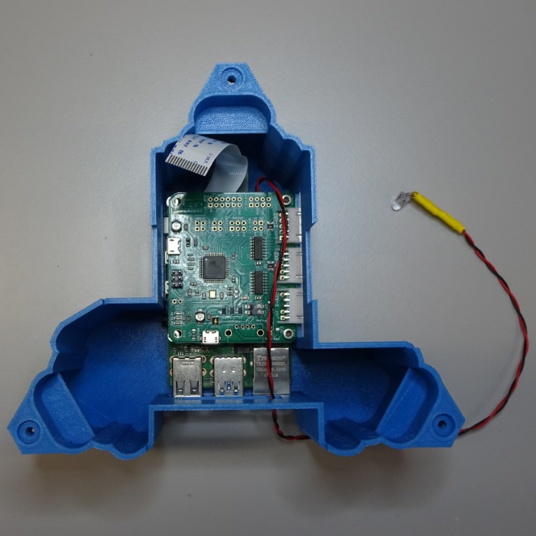

### Plug in motors {pagestep}

Plug in the motors.  Motor cables from motors `a` and `b`  can enter though the window in the side of the case and the motor cable from motor `c` can enter through the window at the back or the side. The correct order to plug in the motors can be seen here:

#### Sangaboard v0.2

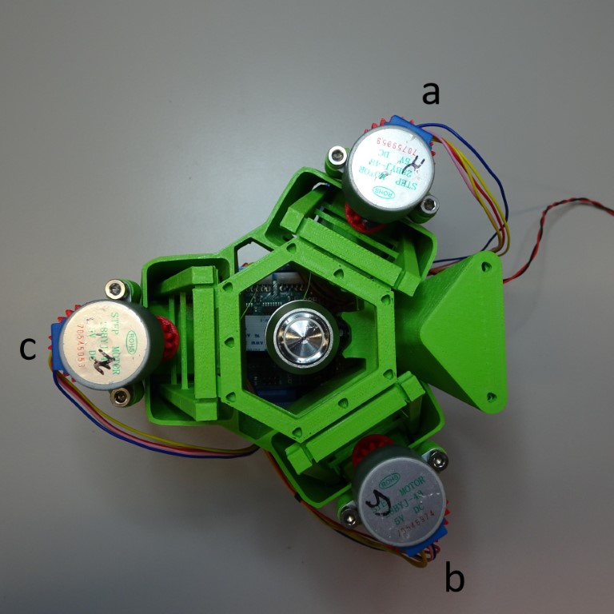
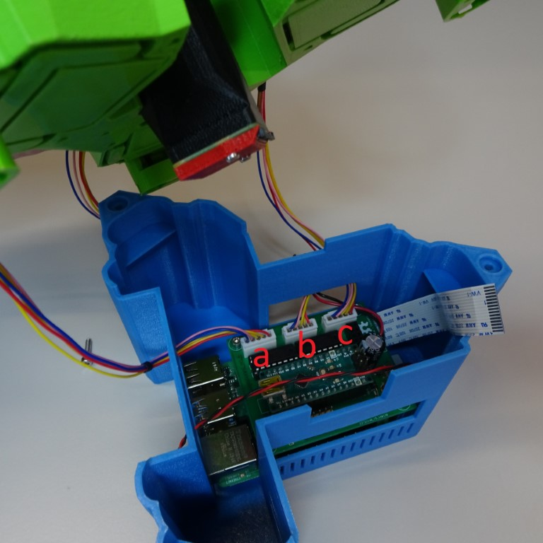

#### Sangaboard v0.3

(For other motor controllers: `a = x`, `b = y`, `c = z`)

### Attach the camera ribbon cable {pagestep}

Connect the ribbon cable to the camera module.

### Put microscope into base {pagestep}

The microscope [main body] fits tightly into the [Raspberry Pi & Sangaboard base].

### Secure the microscope to the base

Insert one [M3 nut]{qty:3} into the nut trap in the base.  It may be necessary to clear out the hole of printing artefacts.  

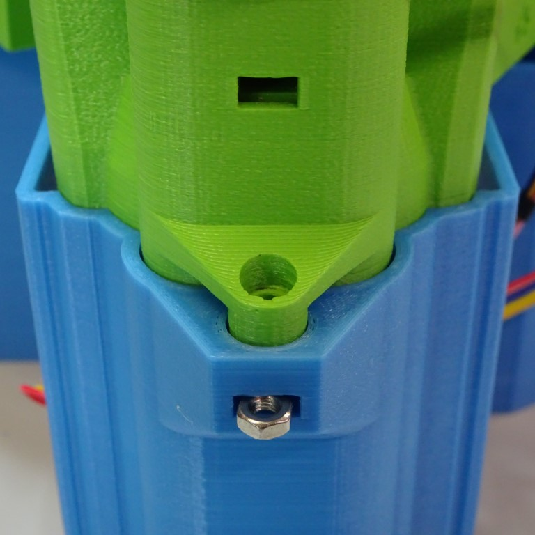

Insert one [M3x12mm screw]{qty:3} into the hole in the microscope [main body].  Screw it in place using a [2.5mm hex screwdriver]{qty:1}.

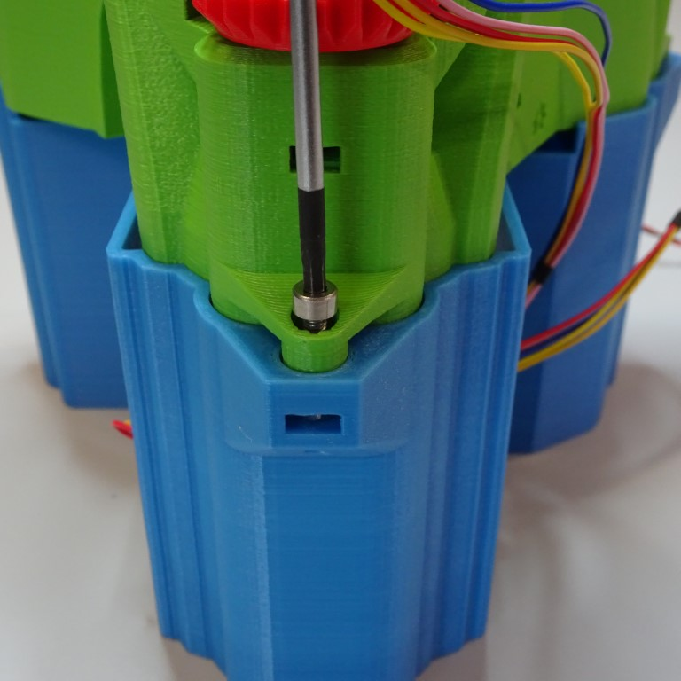

Repeat for the other two base connectors.

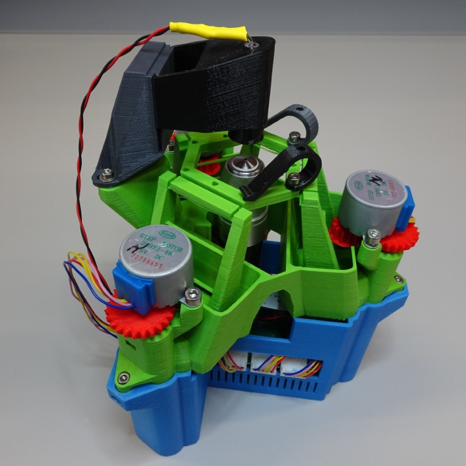

### Connect the Sangaboard {pagestep}

The Sangaboard connects to the Raspberry Pi from the Arduino USB port by [USB cable]{qty:1}. There is a special window for the USB cable to pass through.

#### Sangaboard v0.2

#### Sangaboard v0.3

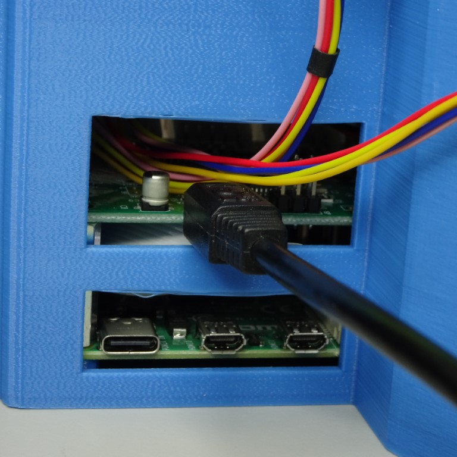
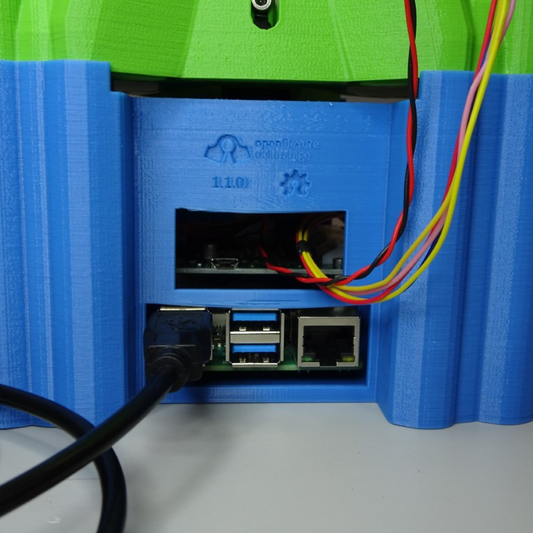
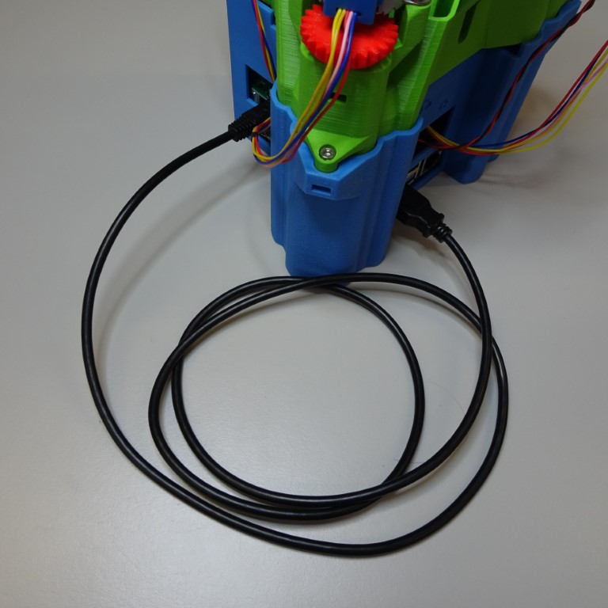
### Attach external components {pagestep}

There are windows around base to connect external components.  On the side there is space for USB power to the Raspberry Pi and Sangaboard v0.2 and HDMI.

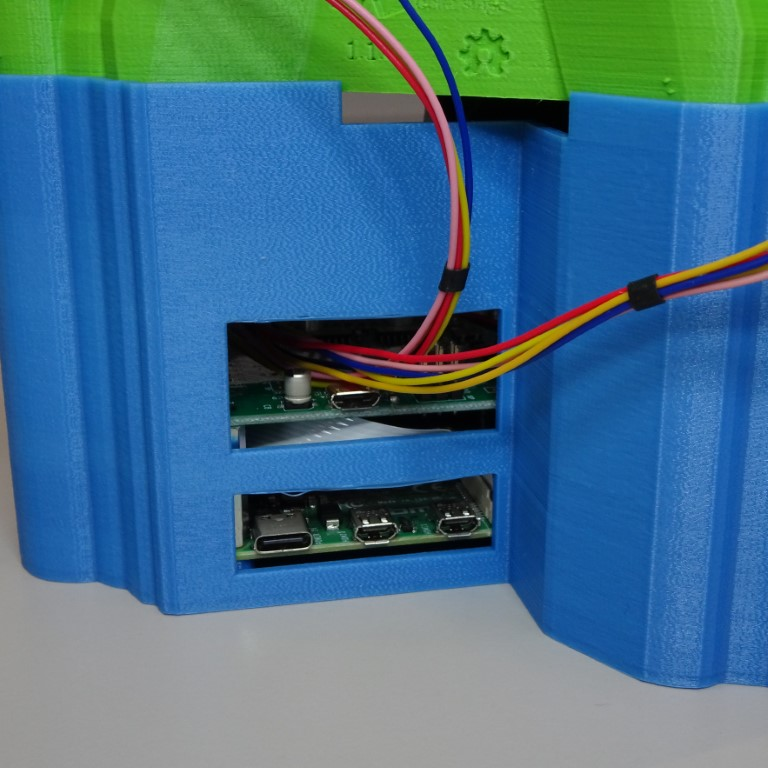
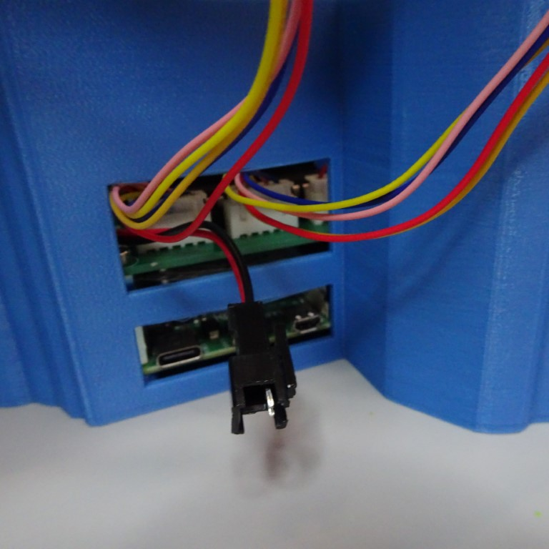

At the back there is space for USB components (for example: keyboard, mouse, memory stick), ethernet and power supply for the Sangaboard v0.3.

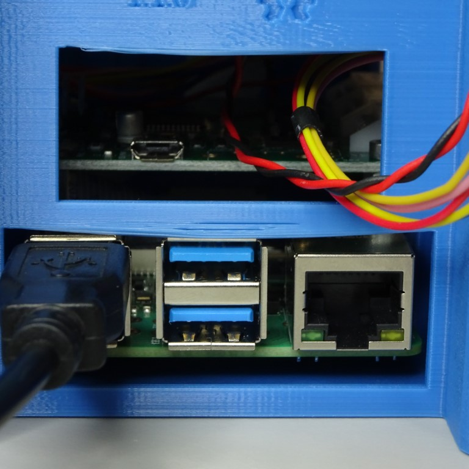
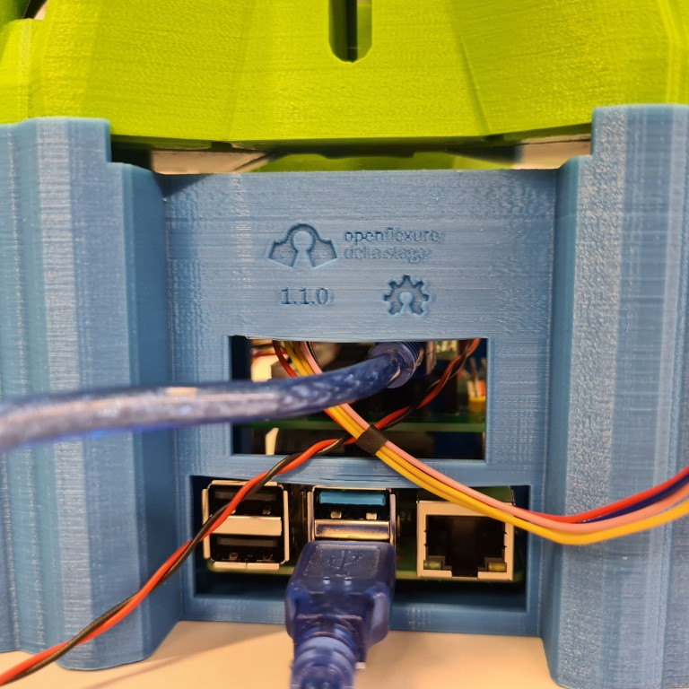
